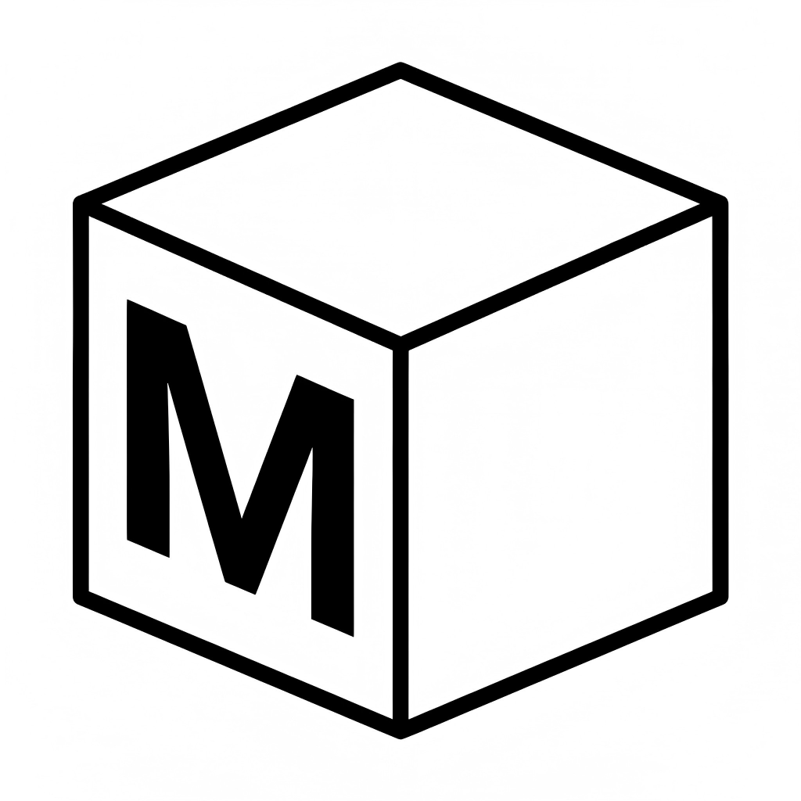

#  M-Cube (M³) — Multi-thinking, Multimodal, Multi-verification Patent Drafting Assistant

[](https://opensource.org/licenses/MIT)
[](https://fastapi.tiangolo.com/)
[](https://react.dev/)
[](https://v2.tauri.app/)
[](https://langchain-ai.github.io/langgraph/)

M-Cube is a multi-thinking, multimodal, and multi-verification multi-agent collaborative patent drafting assistant. It relies on LangGraph for multi-agent orchestration, introducing multiple AI Agents to conduct multi-step reasoning. At different stages, it accomplishes various functions—including patent drafting, Office Action (OA) responses, prior art comparison, and claim polishing—based on the multimodal information of patent text and drawings. Throughout the process, it incorporates multiple verifications, such as specification support checks and prior art text-to-image logical verifications, ultimately outputting patent documents with self-consistent technical solutions, robust claims, and mutually corroborating drawings and text.

## ✨ Core Features

M-Cube has three core features:

* 🧠 **Multi-thinking**

  Based on LangGraph for multi-agent orchestration. Each function possesses a complete working chain of thought, utilizing multiple agents for in-depth analysis and reasoning of documents. It automatically executes multiple rounds of internal adversarial checks, chain-of-thought expansions, and logical reviews during specification drafting, OA responses, patent comparisons, and patent polishing.

* 👁️ **Multimodal**

  Leveraging underlying libraries like PyMuPDF and Pillow, alongside Vision LLMs, M-cube can directly read and dissect complex mechanical topological diagrams and prior art drawings. This achieves precise cross-mapping and verification between patent text and images.

* 🛡️ **Multi-verification**

  Built-in multiple legal compliance audits and anti-hallucination verifications. All output features must have concrete anchors in the technical disclosure or drawings. Human-in-the-Loop (HITL) mechanisms are introduced at critical nodes to ensure complete avoidance of Article 33 (modifying beyond the original scope) red-line risks.

## 💼 Workflows

The workflows of M-Cube are illustrated below:


M-Cube deeply abstracts the core working scenarios of patent attorneys, providing four industrial-grade workflows:

1. 📝 **Patent Drafting**: Performs atomic-level feature breakdown and drawing analysis based on technical disclosures. It drafts claims and specifications through multi-agent collaboration, providing traceability checks and logical reviews against the disclosure.
2. ⚔️ **Office Action (OA) Response**: Deeply parses official examination opinions and analyzes the current case against prior art. It determines modification strategies based on the OA, mines fallback features from the specification, conducts feature verification, and ultimately generates the arguments and A33-compliant replacement sheets.
3. 🔍 **Prior Art Comparison**: Analyzes the text and drawings of the current case and prior art documents. It compares features and connection relationships, outputting novelty/inventive step risk grading and subsequent modification suggestions.
4. ✨ **Claim Polishing**: Reconstructs the application document, troubleshooting formal defects in the claims such as unclear preambles, lack of antecedent basis, and non-technical features. It also conducts a logical review of the modified documents.


## 🏗️ Architecture

M-Cube adopts a high-performance hybrid architecture of `FastAPI + React + Tauri`, supporting both cloud SaaS deployment and local geek-style offline execution.

* **Backend Engine**: Python 3.10+, FastAPI, Uvicorn, LangGraph, Pydantic v2, sse-starlette. 
* **Frontend Web**: React 18, TypeScript, Vite 5, Tailwind CSS, Zustand. 
* **Native Desktop**: Tauri 2, Rust 2021. 

## 🚀 Getting Started

### Prerequisites
- [Python 3.11+](https://www.python.org/)
- [uv](https://docs.astral.sh/uv/) (Python package & project manager — replaces `pip`)
- [Node.js 18+](https://nodejs.org/)
- [pnpm 10+](https://pnpm.io/) (frontend package manager — replaces `npm`)
- [Rust Toolchain](https://rustup.rs/) (Only required for Tauri desktop dev/build) 
- [Docker Desktop](https://www.docker.com/products/docker-desktop/) (Only required for Docker deployment)

> Install uv (one-liner):
> - macOS/Linux: `curl -LsSf https://astral.sh/uv/install.sh | sh`
> - Windows (PowerShell): `powershell -ExecutionPolicy ByPass -c "irm https://astral.sh/uv/install.ps1 | iex"`
>
> Install pnpm (recommended via Corepack, no extra install needed once Node.js ≥ 16.13):
> ```bash
> corepack enable
> ```
> Or standalone: `npm i -g pnpm` / `brew install pnpm`

### 0. Clone and Initialize

Under the project directory:

Windows:
```powershell
copy .env.example .env
```

macOS/Linux:
```bash
cp .env.example .env
```

Please fill in at least one available model API Key (e.g., `OPENAI_API_KEY`, `DASHSCOPE_API_KEY`) in the `.env` file. Now you can choose the option that works best for you:

### 1. Docker Deployment

Prerequisites:

- Docker installed and running.
- Prepare the `.env` file in the project root directory and fill in the model API Keys as needed.

Start:

```bash
docker compose up --build
```

Access:

- Frontend: `http://127.0.0.1:1420`
- Backend: `http://127.0.0.1:8000`

View Logs:

```bash
docker compose logs -f backend
docker compose logs -f frontend
```

Stop:

```bash
docker compose down
```

### 2. Local Web Development

**Terminal 1 (Start Backend Engine)**:

```bash
# Install runtime dependencies from pyproject.toml + uv.lock into .venv
uv sync --frozen
# Run uvicorn inside the synced environment
uv run uvicorn main:app --host 127.0.0.1 --port 8000 --reload
```

**Terminal 2 (Start Frontend Service)**:

```bash
pnpm --dir frontend install
pnpm --dir frontend dev
```

**Network Service Access**:

- Frontend UI: `http://localhost:1420`
- Backend API: `http://127.0.0.1:8000`

### 3. Desktop Development (Tauri)

Note: The `tauri:dev` command only launches the native desktop shell and will not automatically start the Python backend. Please ensure the backend service is running first according to Step 1 (Terminal 1).

```bash
pnpm --dir frontend install
pnpm --dir frontend tauri:dev
```

### 4. Local Desktop App

```bash
pnpm --dir frontend tauri:build
```

Note: If you encounter a missing PyInstaller error during local building, you can run:
```bash
uv sync --frozen --group build
```

## 📄 License

M-Cube is licensed under the [MIT License](LICENSE).
